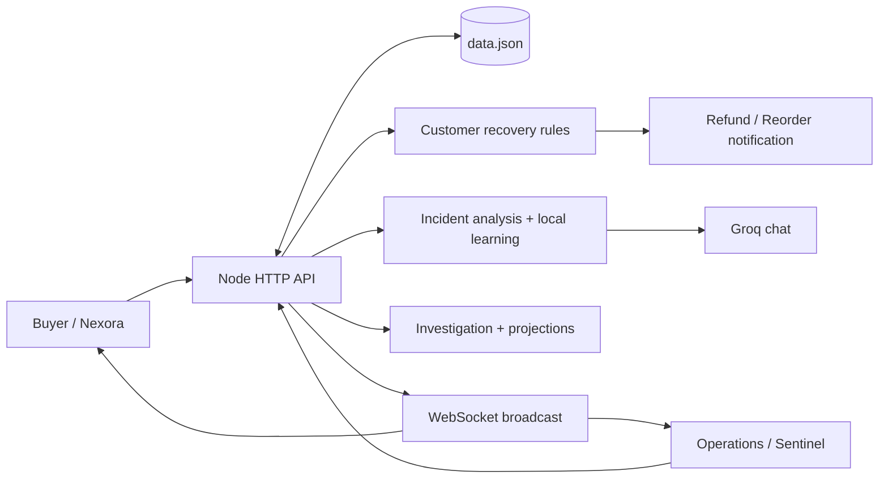
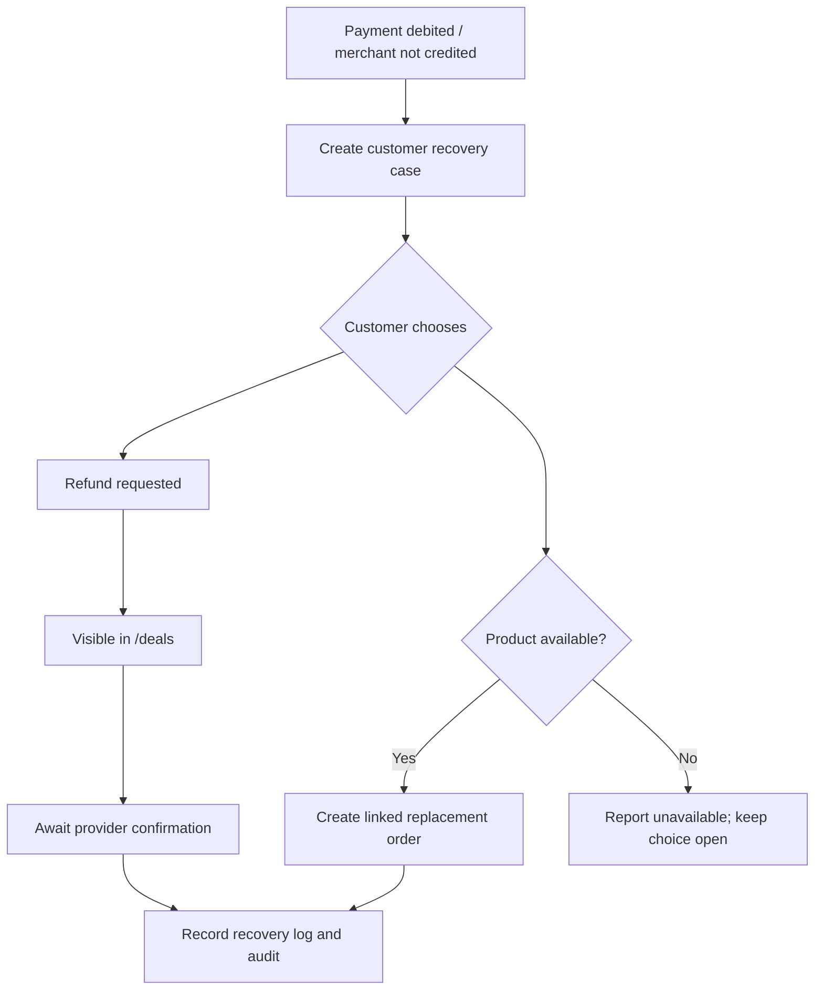

<div align="center">

# NEXORA × SENTINEL

### Commerce meets incident intelligence.

A connected shopping demo that turns checkout failures into traceable incidents, customer recovery choices, and business-impact analysis.


[View deployed demo](https://lasyep.vercel.app) · [Explore the code](https://github.com/btechece241829-del/enterprise-agent) · [Quick start](#quick-start) · [Prediction dashboard](#investigation--business-projection)

</div>

---

> **Project status:** A working local commerce and incident-recovery simulation. Payments, refunds, network conditions, and revenue projections are simulated. The deployed Vercel preview has known session-persistence and WebSocket limitations; see [Deployment](#deployment).

## The idea

An order fails. The customer has been debited, but the organization has not received the payment. What happens next?

Sentinel records the evidence, opens a recovery case for that customer, offers **Refund** or **Reorder**, and keeps the outcome visible to operations. The intelligence layer explains incidents using recorded evidence, while the prediction dashboard connects those incidents to business recovery opportunities.

**Nexora** is the customer-facing storefront. **Sentinel** is the operations, investigation, and intelligence layer behind it.

## Explore

- [Features](#features)
- [System architecture](#system-architecture)
- [Quick start](#quick-start)
- [Checkout and recovery walkthrough](#checkout-and-recovery-walkthrough)
- [Intelligence and learning](#intelligence-and-learning)
- [Investigation & business projection](#investigation--business-projection)
- [Pages and API](#pages-and-api)
- [Deployment](#deployment)
- [Tests and troubleshooting](#tests-and-troubleshooting)
- [Project structure](#project-structure)
- [Current boundaries](#current-boundaries)

## Features

| Experience | What is implemented |
| --- | --- |
| **Storefront** | Product browsing, category filtering, search, cart, order history, and responsive styling. |
| **Name-based buyer entry** | Customers enter a name to establish a shopping session; no buyer password is required. |
| **Checkout scenarios** | Four numbered, mutually exclusive choices demonstrate successful orders, network failure, and payment failure. |
| **Customer recovery** | Payment settlement mismatches open a customer-specific recovery case with Refund / Reorder choices. |
| **Operations overview** | Transaction metrics, payment failures, recovery cases, refund requests, and reorder counts. |
| **Detailed logs** | Order/payment results, network metrics, decision details, ticket-style inspection, and PDF reports. |
| **Incident intelligence** | Evidence-based incident grouping plus Groq chat grounded in selected operational records. |
| **Learning memory** | Locally derived patterns and recovery counts saved with application data. |
| **Prediction** | Per-order investigation, probable causes, rectification plans, verification status, and recovery-value scenarios. |
| **Live local updates** | WebSocket broadcasts update supported dashboard and notification views on the standalone server. |
| **LAN access** | An overview QR code points to the detected network address and shop port. |
| **Administration** | Role checks, audit records, and super-admin controls for deleting logs, transactions, and individual orders. |

## System architecture



The frontend uses HTML, CSS, and vanilla JavaScript. The backend uses Node's HTTP server, with `ws` for local live updates, `qrcode` for shop sharing, `pdfkit` for reports, and `dotenv` for configuration. Groq is called from the server; the API key is not sent to the browser.

## Quick start

Use Node.js with built-in `fetch` support and npm. The project has been run with Node.js 24.

```bash
git clone https://github.com/btechece241829-del/enterprise-agent.git
cd enterprise-agent
npm ci
```

Copy the environment template:

```powershell
# Windows PowerShell
Copy-Item .env.example .env
```

```bash
# macOS / Linux
cp .env.example .env
```

Edit `.env`:

```dotenv
PORT=8000
GROQ_API_KEY=your_groq_api_key_here
GROQ_MODEL=openai/gpt-oss-20b
```

```bash
npm start
```

Open **http://localhost:8000/welcome** to enter a buyer name, or **http://localhost:8000/login** for operations.

| Variable | Purpose |
| --- | --- |
| `PORT` | Standalone listening port. The template uses `8000`; the code falls back to `3000` if absent. |
| `GROQ_API_KEY` | Enables Groq chat. Rule-based incident analysis and recovery do not require this key. |
| `GROQ_MODEL` | Model identifier; defaults to `openai/gpt-oss-20b`. |

The server seeds `data.json` on first local use. `.env`, `data.json`, dependencies, and generated output are excluded from Git. Restart the local server after changing environment values.

### Demo operations accounts

These credentials are seeded for demonstration, not production access control.

| Role | Email | Password |
| --- | --- | --- |
| Super admin | `admin@sentinel.test` | `Admin123!` |
| Manager | `manager@sentinel.test` | `Manager123!` |
| Analyst | `analyst@sentinel.test` | `Analyst123!` |

### Share on the same LAN

Run the standalone server, open the operations overview, and scan its shop QR code from a device on the same network. The server binds to `0.0.0.0`. The generated address includes the port, for example `http://192.168.1.20:8000/shop`. The host firewall must allow the connection; `localhost` on a friend's phone refers to their phone, not your computer.

## Checkout and recovery walkthrough

The checkout UI deliberately displays only **1**, **2**, **3**, and **4**. Their behavior remains:

| Choice | Internal scenario | Expected result |
| --- | --- | --- |
| **1** | Safe network | Confirmed order; safe metrics recorded. |
| **2** | Critical network | Failed order; latency `300ms`, packet loss `3%`, and error rate `3%` recorded. |
| **3** | Payment succeeds | Confirmed simulated payment and order. |
| **4** | Payment failure | Failed order; customer debit / merchant non-receipt recorded; recovery case opened. |

Only one radio option can be selected. Choices 1, 3, and 4 use simulated safe network metrics of `120ms` latency, `0.5%` packet loss, and `0.5%` error rate. Choice 4 fails because of the payment scenario.

1. Enter your name, add a product, and open checkout.
2. Select **4** and click **Place order**.
3. Open `/notification` in the same buyer session.
4. Choose **Request refund** or **Reorder**.
5. Inspect `/dashboard/logs`, `/deals`, and `/dashboard/prediction` from the appropriate session.



The API scopes recovery actions to the buyer session and rejects a second selection with HTTP `409`. A refund request is **not** a completed refund. Reorder currently recreates one unit of the first affected product at its current price; full original-cart restoration is not implemented.

## Intelligence and learning

Sentinel combines three distinct mechanisms:

| Layer | Responsibility | Boundary |
| --- | --- | --- |
| **Deterministic rules** | Evaluate checkout conditions, identify settlement mismatches, and initiate allowed recovery workflows. | Rules drive actions; Groq does not execute refunds or infrastructure fixes. |
| **Incident analysis** | Group recorded payment/network evidence into 15-minute buckets with stable incident IDs. | Observed symptoms do not prove the underlying provider or infrastructure root cause. |
| **Groq chat** | Explain supplied logs, orders, incidents, and learned patterns using structured answers and evidence. | Read-only operational analysis; no arbitrary source-code access or code execution. |

The “learning” layer recomputes local patterns from saved logs and recovery outcomes and stores them in `intelligenceMemory` within `data.json`. These patterns are included in Groq's context. It does **not** retrain or fine-tune model weights, discover new policies autonomously, or automatically repair infrastructure. Pattern confidence values are heuristic rather than calibrated probabilities.

Chat returns an answer, evidence, recommended action, risk level, and approval flag. Its server-side request has a 15-second timeout. Chat audit events do not trigger a full dashboard refresh, preserving the visible response. On the intelligence page, new local activity offers an explicit analysis refresh.

Example questions:

- “Which recorded failures are payment issues rather than network issues?”
- “What evidence supports this incident assessment?”
- “What patterns have repeated across recent checkout failures?”

## Investigation & business projection

Open **`/dashboard/prediction`** to inspect each failed or blocked original order:

1. **Error and investigation:** failure details, affected products, customer, amount, and timestamps.
2. **Root cause assessment:** the recorded trigger and the limits of the available evidence.
3. **Rectification plan:** payment reconciliation, customer recovery, or network investigation steps.
4. **Resolution verification:** linked replacement status, pending refunds, evidence trail, and timeline.

The business view separates failed-order value, verified reorder value, pending refund requests, and unresolved recovery opportunity. It explains how customer recovery, transparent refunds, fewer repeat failures, and focused investigation could support business performance—and what must be measured to prove that improvement.

### Projection methodology

```text
Eligible opportunity = unresolved failed/blocked original-order value
                       excluding refund-selected cases and verified reorders

Potential order value = eligible opportunity × assumed recovery rate
```

| Scenario | Assumed recovery rate |
| --- | --- |
| Conservative | 20% |
| Planning | 40% |
| Optimistic | 60% |

Each original order is counted once. Verified reorder value is capped at the original order value. A reorder is counted as verified only when its linked replacement is confirmed and the recovery verification status is `PASSED`.

These are **scenario calculations over recorded simulated history**, not trained forecasts, monthly revenue predictions, cash collected, or profit. Proving AI-driven revenue uplift requires verified settlement, costs, and comparison/control data that this demo does not collect.

## Pages and API

### Main pages

| Route | Purpose |
| --- | --- |
| `/welcome` | Name-based customer entry |
| `/shop`, `/products`, `/product/:id` | Storefront and catalog |
| `/cart`, `/checkout` | Cart and numbered checkout choices |
| `/orders`, `/order/:id` | Customer order history and outcome |
| `/notification` | Buyer-specific updates and recovery choices |
| `/deals` | Refund requests; buyers see their own, operations roles can see all |
| `/login` | Operations sign-in |
| `/dashboard/overview` | Operational metrics and LAN shop QR code |
| `/dashboard/logs` | Detailed logs and ticket inspection |
| `/dashboard/intelligence` | Incident analysis, learning memory, and Groq chat |
| `/dashboard/prediction` | Investigations, verification, and business scenarios |

Legacy notification spellings `/notfication` and `/notifican` remain accepted.

### Selected API endpoints

Authenticated endpoints use `Authorization: Bearer <session-token>`. Operations endpoints enforce role checks; destructive log/order/transaction actions require super-admin access.

| Method | Endpoint | Function |
| --- | --- | --- |
| `POST` | `/api/buyers/session` | Start a buyer session using a name |
| `POST` | `/api/auth/login` | Authenticate an operations account |
| `GET` | `/api/products` | Product catalog |
| `GET / POST` | `/api/cart`, `/api/cart/items` | Read cart / add an item |
| `POST` | `/api/checkout` | Execute the selected checkout scenario |
| `GET` | `/api/notifications` | Buyer-scoped order and recovery updates |
| `POST` | `/api/recovery/refund`, `/api/recovery/reorder` | Submit `{ "incidentId": "…" }` for the buyer's case |
| `GET` | `/api/deals` | Refund request queue |
| `GET` | `/api/dashboard/data`, `/api/logs` | Operations data and logs |
| `GET` | `/api/intelligence` | Incident and learning context |
| `POST` | `/api/intelligence/chat` | Submit `{ "question": "…" }` to Groq |
| `GET` | `/api/prediction` | Investigation and projection report |
| `GET` | `/api/reports/network/pdf` | Download the network log report |
| `DELETE` | `/api/logs/:id`, `/api/orders/:id` | Delete an individual log or order and its transaction |
| `DELETE` | `/api/logs`, `/api/transactions` | Clear the selected collection |

## Deployment

### Standalone Node server

`npm start` runs the HTTP and WebSocket server together. This is the intended environment for demonstrating shared state and live updates with the current implementation. `data.json` must remain on writable, persistent storage. Local files are not a multi-instance database.

### Vercel preview

The repository includes `vercel.json`, and the deployed preview is [lasyep.vercel.app](https://lasyep.vercel.app). Configure Groq values through the hosting environment, not through committed credentials.

**Known limitation:** the current serverless implementation uses process-local memory when its data file cannot be written. Different instances may have different sessions and records, and cold starts/redeployments may discard them. As a result, sign-in, checkout, intelligence, and history can fail or appear inconsistent in the preview. The exported serverless handler also does not start the WebSocket server. A successful page load does not establish that all stateful workflows work reliably.

### Railway configuration

`railway.json` specifies the Node start command and restart policy. A Railway configuration is included, but this README does not claim an active Railway deployment. Set Groq variables in the hosting environment and provide persistent storage for `data.json` or replace it with a shared database. A restart policy alone does not preserve application data.

## Tests and troubleshooting

```bash
npm test
```

The tests cover entry points, payment/network classification, preserving intelligence chat during update events, projection deduplication, verified recovery handling, and empty/missing-data behavior. They do not replace end-to-end browser testing or verify real payment processing.

| Symptom | What to check |
| --- | --- |
| Groq is unavailable | Configure `GROQ_API_KEY` and restart the local server or redeploy after setting hosted environment variables. |
| Session expires repeatedly on Vercel | The preview lacks shared persistent session storage; see the deployment limitation above. |
| No notifications | Enter through `/welcome` and use the same buyer session that placed the order. |
| No investigation records | Prediction uses failed/blocked orders; empty history correctly produces no cases and zero opportunity. |
| Friend cannot open the QR link | Use the same LAN, keep the server running, and check the detected IP address, port, and host firewall. |
| Response disappears after an old cached page loads | Reload to load current scripts; current chat audit updates do not rerender the intelligence page. |
| Port already in use | Stop the other server or change `PORT` in `.env`. |

## Project structure

```text
enterprise-agent/
├── server.js                 # HTTP routes, sessions, checkout, persistence, WebSockets
├── recovery.js               # Payment recovery case creation
├── incident-analysis.js      # Evidence-based incident classification
├── intelligence.js           # Groq request and structured response handling
├── intelligence-learning.js  # Derived local pattern memory
├── prediction.js             # Investigation and business scenario calculations
├── report2.js                # Network PDF report generation
├── public/
│   ├── app.js                # Storefront and dashboard routing
│   ├── intelligence-ui.js    # Incident cards and chat
│   ├── prediction.js         # Investigation and projection view
│   ├── notifications.js      # Customer notifications and recovery actions
│   ├── dashboard-realtime.js # Local dashboard WebSocket updates
│   ├── log-ticket.js         # Detailed incident tickets
│   └── polish.css            # Shared visual design
├── test/                     # Node test runner tests
├── .env.example              # Configuration template, no real secrets
├── vercel.json               # Serverless preview configuration
├── railway.json              # Standalone hosting configuration
└── data.json                 # Generated runtime state; excluded from Git
```

## Current boundaries

This project is a demonstration, with the following implementation gaps to address before production use:

- Shared database storage, transactional writes, durable sessions, and concurrency-safe recovery processing.
- Production authentication: replace seeded demo credentials, strengthen password storage, and enforce buyer identity consistently. Some order lookups currently use buyer names rather than unique customer IDs.
- Full-cart reorder restoration, inventory reservation/decrement, and real payment/refund-provider verification.
- Network threshold consistency: the checkout evaluator currently uses latency `>200ms`, while newer incident analysis and prediction use `>250ms`. The predefined choices use `120ms` and `300ms`, so their expected results are unaffected.
- Learning statistics: the legacy learning aggregator still includes critical payment-failure logs in its network averages. The newer incident analyzer distinguishes settlement mismatches from network threshold breaches.
- Provider-confirmed settlement, measured support costs, and comparison data before attributing revenue improvements to AI.

## License & author

Created by **PRADIP KUMAR**. Distributed under the [MIT License](LICENSE).

<div align="center">

**Observe the failure. Explain the evidence. Track the recovery.**

</div>
